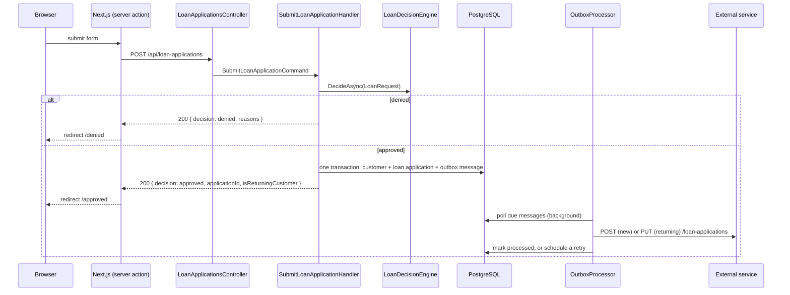

# Architecture

This page explains how the solution is built and why. It is meant to be read next to the code. Each section names the files it describes.

## Request flow



## Project structure

| Path | Responsibility | Depends on |
|---|---|---|
| `backend/src/LoanFlow.Domain` | Business rules with no framework code: the `Customer` aggregate, value objects (`Ssn`, `Address`, `LoanAmount`, `LoanRequest`), and the rule engine (`Decisions/`). | nothing |
| `backend/src/LoanFlow.Application` | Use cases and the ports they need: `SubmitLoanApplicationHandler`, `SyncApprovedApplicationHandler`, and the interfaces `ICustomerRepository`, `IUnitOfWork`, `IEventPublisher`, `IEventHandler<T>`, `IExternalLoanService`. | Domain |
| `backend/src/LoanFlow.Infrastructure` | Adapters for the ports: EF Core + PostgreSQL, the outbox and its background processor, the typed `HttpClient` for the external service, and the SSN blacklist read from configuration. | Application |
| `backend/src/LoanFlow.Api` | Composition root and HTTP: one thin controller, request/response contracts, and exception → problem details mapping. | Infrastructure |
| `backend/tests/LoanFlow.UnitTests` | Domain, rule engine and use cases, using hand-written fakes. | Application |
| `backend/tests/LoanFlow.IntegrationTests` | Endpoint, transaction rollback and outbox delivery against real PostgreSQL (Testcontainers). | Api |
| `frontend` | Next.js form, server action and decision pages. | the API over HTTP |
| `external-service` | Mock of the external service (Node, no dependencies). | nothing |

Dependencies only point inward, and the project references enforce it: the domain cannot reference EF Core or ASP.NET because its project does not reference them. That is why there is no extra architecture-test library.

## Domain model

- **`Customer` is the aggregate root and owns its `LoanApplication`.** The brief says one SSN means one customer and one application, and that both are saved together. That is one consistency boundary, so it is one aggregate saved in one transaction. `Customer.Register` opens the application; `Customer.Resubmit` updates the customer details and the requested amount. They are still two tables: `customers` and `loan_applications (id, requested_amount, customer_id)`.
- **Value objects hold the invariants the rules depend on.** `Ssn` accepts `123-45-6789` or `123456789` and compares as nine digits, so a formatted SSN cannot slip past the blacklist. `Address` normalizes the state to a US code, so `ny` is still New York. `Ssn.ToString()` is masked, so an SSN doesn't end up in a log by accident.
- **Validation lives in the domain.** Invalid input throws `DomainValidationException`, which the API returns as `400` problem details. The frontend validates the same rules for UX only.

## Rule engine

`Domain/Decisions`:

- `IDenialRule.EvaluateAsync(LoanRequest)` returns a `DenialReason` or `null`.
- `LoanDecisionEngine` runs **every** rule and collects every reason. No reasons means approved.
- `StateNotServedRule` denies `NY`. `BlacklistedSsnRule` asks the `ISsnBlacklist` port, which `ConfiguredSsnBlacklist` implements from `appsettings.json` (`SsnBlacklist:Ssns`).
- `AddApplication()` registers every `IDenialRule` it finds in the domain assembly.

**Adding a rule** means adding one class in `Domain/Decisions/Rules`. The engine, the other rules and the DI setup stay as they are:

```csharp
public sealed class AmountAboveLimitRule : IDenialRule
{
    public static readonly DenialReason Reason = new("amount-above-limit", "The requested amount is above our limit.");

    public Task<DenialReason?> EvaluateAsync(LoanRequest request, CancellationToken cancellationToken) =>
        Task.FromResult(request.RequestedAmount.Value > 5_000_000m ? Reason : null);
}
```

The frontend shows copy per reason code (`frontend/src/features/loan-application/denial-reasons.ts`) and falls back to a generic message for codes it doesn't know. The blacklist reason is deliberately vague (`identity-not-verified`) so the response does not reveal an anti-fraud check.

## Background event and the external service

**Publishing.** After the decision, `SubmitLoanApplicationHandler` calls `IEventPublisher.Publish(new LoanApplicationApproved(customerId, applicationId, isReturningCustomer))` and then `IUnitOfWork.SaveChangesAsync()` once. `OutboxEventPublisher` only adds a row to `outbox_messages` in the same `DbContext`, so the event is committed together with the customer and the application.

**Processing.** `OutboxProcessor` is a `BackgroundService` inside the API process. Every 2 seconds it loads due messages (not processed, below the attempt limit, `next_attempt_at <= now`) in order. It dispatches each one to its `IEventHandler<T>` in a fresh DI scope and marks it processed. `SyncApprovedApplicationHandler` loads the customer and calls `CreateAsync` for a new customer or `UpdateAsync` for a returning one.

**The event carries IDs, not data.** The handler reads the customer's current state when it runs. A retry or a late delivery always sends the latest data and never overwrites the external record with older values. It also keeps the SSN out of the outbox table.

**Contract** (`external-service/server.mjs`, client in `Infrastructure/ExternalService`):

| Call | When | Response |
|---|---|---|
| `POST /loan-applications` | new customer | `200`. Idempotent by `applicationId`: a replay returns `200` without creating a duplicate. |
| `PUT /loan-applications/{applicationId}` | returning customer | `200`, or `404` if the record doesn't exist yet (for example, the create is still being retried). |
| `GET /loan-applications` | inspection only | everything received |

```json
{
  "applicationId": "01a0aba7-ea98-7414-aeab-4867bea334da",
  "requestedAmount": 40000,
  "customer": {
    "id": "01a0aba7-ea98-73db-9827-2473017587ea",
    "firstName": "Ada", "lastName": "Lovelace", "ssn": "521457788", "companyName": "Analytical Engines LLC",
    "address": { "street": "100 Congress Ave", "city": "Austin", "state": "TX", "zipCode": "78701" }
  }
}
```

- **One resource, one call.** The customer is embedded in the loan application. Two resources would need two calls and could fail halfway.
- **Retries happen in the outbox, not in an HTTP retry policy.** They are stored in the database, so they survive restarts. Any failure (non-2xx, connection refused, the 10-second timeout) counts as an attempt. The next try waits `2^attempts` seconds, capped at 5 minutes. After 10 attempts the message stays unprocessed with `last_error` set, and an error is logged.
- **Delivery is at-least-once.** If the API crashes after the external call but before marking the message processed, the call is repeated. The contract is idempotent for that reason.

## Transactions and failure handling

The unit of work is a single `SaveChangesAsync`. EF Core wraps it in a database transaction that covers the customer insert or update, the loan application insert or update, and the outbox insert.

| What fails | Result |
|---|---|
| Invalid input | `400`, nothing written. |
| A rule denies | `200` with `decision: denied`, nothing written, no event. |
| Any database write (customer, application or outbox row) | The transaction rolls back. `500`, no half-saved customer, no orphan application, no event. The returning-customer path keeps its previous data. `TransactionRollbackTests` forces this with a trigger that rejects the outbox insert. |
| Two first-time submissions with the same SSN at the same moment | The unique indexes on `customers.ssn` and `loan_applications.customer_id` let one commit. The other gets `409` and can resubmit, which then takes the returning-customer path. |
| External service down, slow or returning an error | The application is already committed and the user already has an answer. The message stays pending and is retried with backoff. |
| API stops before delivering | The message is still in `outbox_messages` and is delivered after restart. |

## Trade-offs: what I left out and why

- **No message broker.** A database outbox read by a background service in the API process gives the required atomicity with the database the app already has. A broker would still need an outbox to be atomic with the database, so it would only add infrastructure.
- **One outbox processor instance.** Running several API instances would need `FOR UPDATE SKIP LOCKED` and per-customer ordering. Not needed here.
- **No MediatR, CQRS pipeline or generic repository.** There is one command and one event. The controller calls the handler directly.
- **SSN stored in plain text.** In production it would be encrypted at rest, with a keyed hash (HMAC) column for lookups. The SSN is masked in logs and in the mock's console output.
- **Last write wins** when the same customer resubmits concurrently. There is no concurrency token, because the brief asks for "the latest submission".
- **The response says whether the SSN was already known** (`isReturningCustomer`). Without authentication (out of scope), that lets anyone check whether an SSN exists. A real product would put this flow behind identity verification.
- **Migrations run at API startup** so the stack works with one command. In production they would run as a deployment step.
- **Processed outbox rows are never cleaned up**, and there is no dashboard for messages that exhausted their retries. `last_error` and the logs are the diagnostics.
- **No authentication, rate limiting or structured logging.** The brief excludes authentication, and the other two don't change the design being evaluated.
